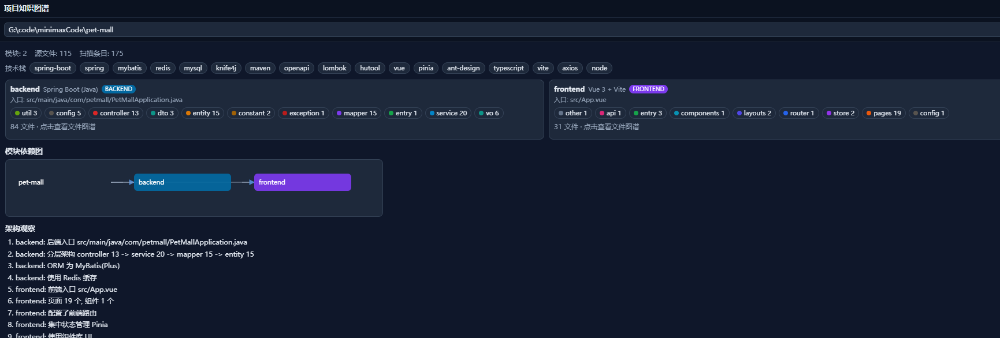
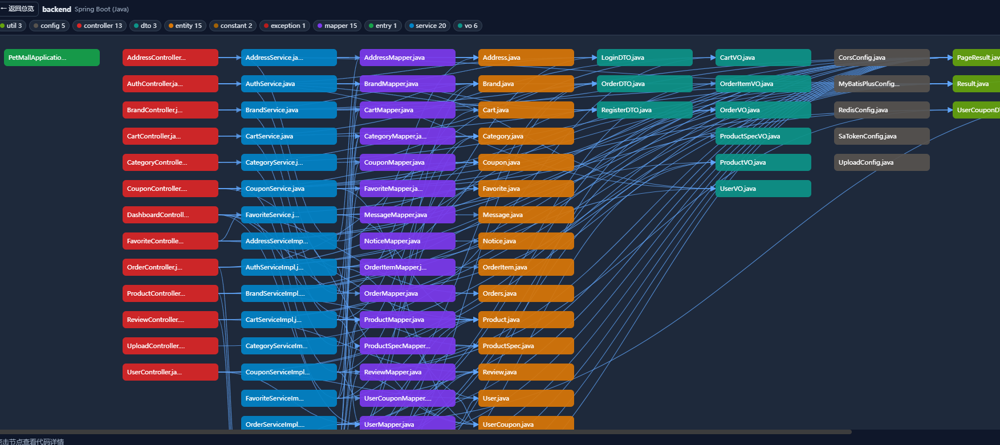

# dsh-kgraph-plugin — Project Knowledge Graph

English | [中文](README.md)

> A DSH (DeepSeek Harness) bundle plugin that scans any project directory **read-only** and builds a **module-level + file-level knowledge graph**, so you can quickly understand the overall architecture and design of a codebase before evolving or optimizing it.
>
> Packaged as a standard **bundle** per the [official DSH publishing docs](https://deepseek-harness.github.io/deepseek-harness/develop/basic/publish). Installable via npm / GitHub / tarball.

## 📸 Preview





## ✨ Features

- **Read-only analysis**: uses the DSH `fs` service only (resolve / listDir / stat / readText); never modifies the scanned project
- **Multi-module detection**: splits monorepos automatically by manifest (`pom.xml` / `package.json` / `go.mod` / `requirements.txt` / `pyproject.toml`, etc.)
- **Multi-language dependency resolution**: Java/Kotlin (fully-qualified class index), TS/JS/Vue (aliases + relative paths), Python (dot paths), Go (root-relative imports)
- **Layer classification**: controller / service / mapper / entity / dto / config / pages / components / router / store / api / util, etc.
- **Graph output**: module dependency graph, per-module file-level graph, tech stack, entry points, key files, architecture observations
- **Usage entry**: **floating UI panel** (bottom-right, primary entry — type a path and scan) · `project_kgraph` model tool (Agent-readable, shares the same scan cache with the panel)

## 📦 Installation

Recommended (explicit version to avoid pnpm lockfile caching an older release):

```sh
dsh plugin --profile web add dsh-kgraph-plugin@0.3.0
```

> Add `--registry=https://registry.npmjs.org` if your npm default registry is a mirror. Tarball (`dsh plugin add ./xxx.tgz`) and GitHub (`dsh plugin add github:you/dsh-kgraph-plugin`) installs are also supported.
>
> Verify: `dsh --profile web --dump-config` should show the `# == dsh-kgraph-plugin` layer. Remove: `dsh plugin --profile web remove dsh-kgraph-plugin`.

## 🚀 Usage

After installation and startup, a **「Project Knowledge Graph」 floating panel** appears at the **bottom-right** of the page:

1. Enter a project path (e.g. `G:/code/my-project`) → click **Scan**
2. **Overview**: module cards, tech stack, module dependency graph, architecture observations
3. Click a module to open its **file-level layered graph** (controller → service → mapper → …); click any node to view code details
4. Use `⛶` for fullscreen browsing of large graphs, `—` to collapse the panel

Agents can also call the `project_kgraph` tool (`{ "path": "G:/code/my-project" }`) to get the full graph JSON — it shares the same scan cache as the panel.

## 🗂️ Project Structure

```
kgraph-plugin/
├── package.json        # dsh.bundle + dsh.client declarations
├── cordis.patch.yml    # bundle config layer
├── index.js            # Host: scan engine + project_kgraph tool + /api/kgraph data routes
├── lib/client.js       # Browser: floating graph panel (ModuleLoader protocol)
├── asserts/            # screenshots
└── dynamic/            # legacy dynamic-plugin mode sources (optional)
```

## 📜 Changelog

| Version | Notes |
|---|---|
| 0.1.0 | Packaged as a standard bundle |
| 0.1.1 | Fixed `tools` service injection |
| 0.2.x | Added browser UI panel, fullscreen/collapse, shared cache, UI fixes |
| **0.3.0** | **Current**: removed the `/kgraph` command; usage is now the bottom-right panel + `project_kgraph` tool |

## License

MIT
